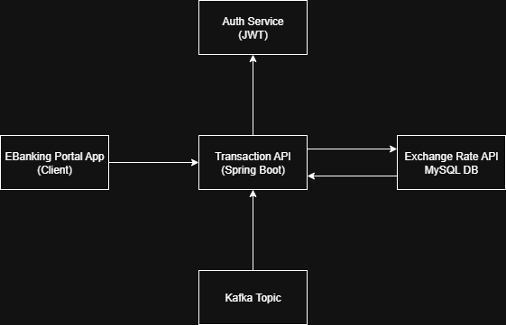
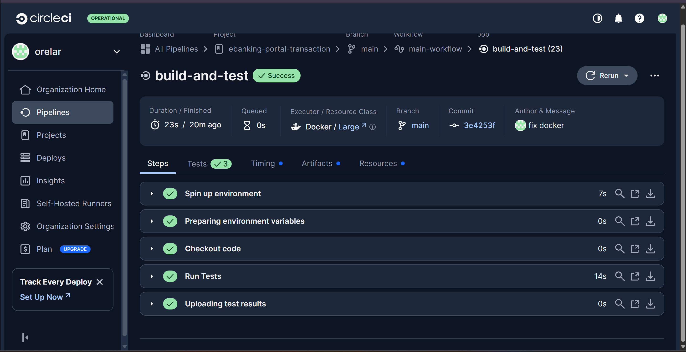
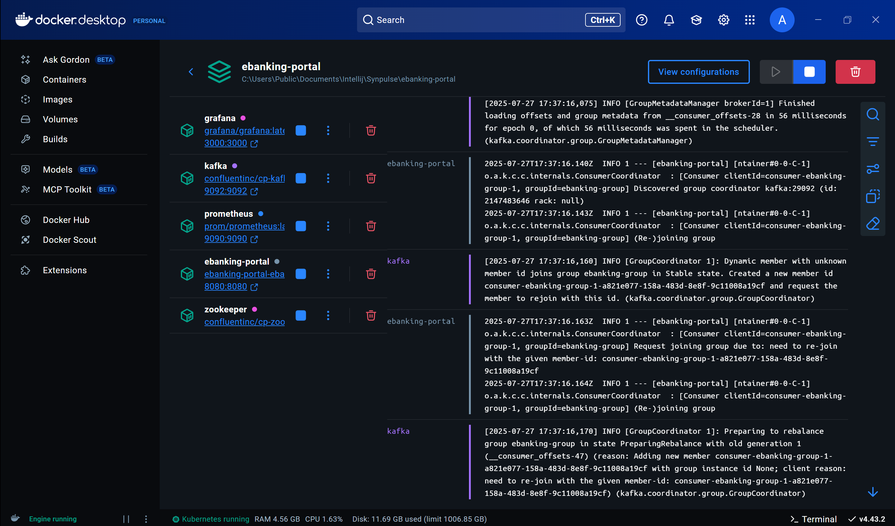
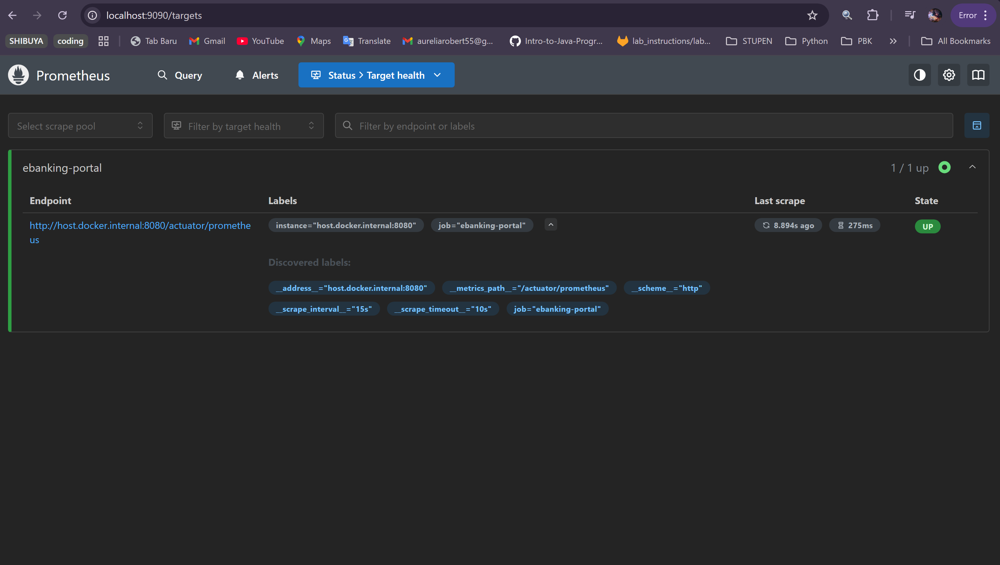
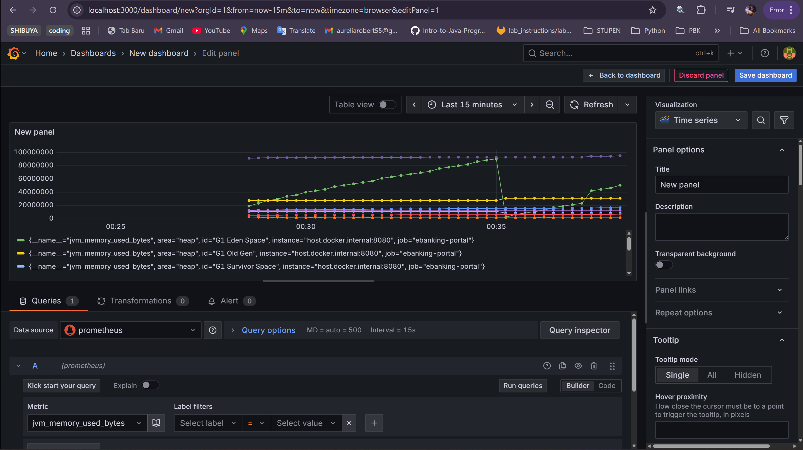

# E-Banking Portal - Backend Challenge

This project is a comprehensive solution developed for a backend engineering hiring challenge. It's a secure, reusable RESTful microservice designed to provide paginated transaction histories for an e-banking portal, with data consumed in real-time from a Kafka topic.

## Features

-   **Secure REST API**: Endpoints are secured using JWT Bearer Token authentication.
-   **Paginated Transactions**: Returns a paginated list of transactions for a given month and year.
-   **Dynamic Totals**: Correctly calculates total credit and debit for each page, converted to a user-specified target currency.
-   **Live Kafka Integration**: Consumes transaction data from a Kafka topic and persists it to the database.
-   **API Documentation**: API endpoints are manually documented below.
-   **Comprehensive Testing**: Includes unit and integration tests covering all application layers.
-   **Containerized**: The application and its dependencies (Kafka, MySQL) can be run with a single Docker Compose command.
-   **Monitoring Ready**: Instrumented with Spring Boot Actuator to expose production-ready metrics.

---

## Architecture

The system is designed as a standalone **microservice**, focusing on the single business capability of managing and serving transaction data. It follows a classic **layered architecture** to ensure a clean separation of concerns.

### Architectural Style
-   **Microservice**: The application is self-contained, independently deployable, and focused on a single responsibility. This allows for scalability and easier maintenance.
-   **Event-Driven**: The service is designed to react to events. It consumes transaction data asynchronously from a Kafka topic, decoupling it from the systems that produce those transactions.
-   **Layered**: The code is organized into distinct layers:
    1.  **Controller Layer**: Handles incoming HTTP requests and API contracts.
    2.  **Service Layer**: Contains the core business logic, including data processing and calculations.
    3.  **Repository Layer**: Manages data access and persistence using Spring Data JPA.
    4.  **Model Layer**: Defines the core data structures (entities and DTOs).

### Key Components
-   **Transaction API (Spring Boot)**: The core of the project. It's a Java application that orchestrates all functionality.
-   **Kafka Topic**: The entry point for new data. The API's `KafkaListener` subscribes to this topic to receive new transaction events in real-time.
-   **MySQL Database**: The system's source of truth for querying. It serves as a durable, query-optimized store for transaction data.
-   **External Services**: The API integrates with external systems like an **Authentication Service** (for validating JWTs) and an **Exchange Rate API** (for currency conversion), which are essential in a real-world microservices ecosystem.

### Data Flow
1.  **Event Ingestion**: The `KafkaListener` consumes a new transaction event from the `transactions-topic`.
2.  **Persistence**: The listener saves the transaction data to the MySQL database.
3.  **Client Request**: A client (like the e-Banking frontend) sends a `GET` request with a valid JWT to the API.
4.  **Security**: The API's security filter validates the JWT.
5.  **Data Retrieval**: The `TransactionService` queries the MySQL database to fetch the requested transactions.
6.  **Enrichment**: The service calls the external Exchange Rate API to get the necessary currency conversion rates.
7.  **Response**: The service calculates the page totals and sends the final, structured DTO back to the client.



---

## Data Model
The core data model is the `Transaction`, which represents a single financial event.

| Field         | Type         | Description                                        |
| :------------ | :----------- | :------------------------------------------------- |
| `id`          | String (UUID)| The unique identifier for the transaction.         |
| `customerId`  | String       | The unique key of the customer who owns the transaction. |
| `accountIban` | String       | The IBAN of the account involved in the transaction. |
| `amount`      | BigDecimal   | The monetary value. Negative for debits, positive for credits. |
| `currency`    | String       | The three-letter currency code (e.g., `CHF`, `GBP`).   |
| `valueDate`   | LocalDate    | The date the transaction took effect.              |
| `description` | String       | A short description of the transaction.            |

---

## Tech Stack

-   **Backend**: Java 17, Spring Boot 3
-   **Data**: Spring Data JPA, MySQL
-   **Messaging**: Spring Kafka
-   **Security**: Spring Security (OAuth2 Resource Server)
-   **Testing**: JUnit 5, Mockito, Testcontainers
-   **Monitoring**: Spring Boot Actuator, Prometheus, Grafana
-   **Containerization**: Docker, Docker Compose
-   **CI/CD**: CircleCI

---

## Getting Started

### Prerequisites
-   Java 17
-   Maven 3.8+
-   Docker & Docker Compose

### 1. Configure
Before running, update the `docker-compose.yml` file with your MySQL password in the `environment` section for both the `db` and `ebanking-portal` services.

### 2. Run
This single command builds and runs the entire stack (application, Kafka, MySQL, Prometheus, Grafana).
```bash
docker-compose up --build -d
```
The application will be available at `http://localhost:8080`.

---

## API Endpoints
A tool like Postman is recommended for testing. All endpoints require a Bearer Token for authorization.

### Get Monthly Transactions
-   **URL:** `/v1/transactions`
-   **Method:** `GET`
-   **Query Parameters:**

    | Name           | Type   | Description                                            |
    | :------------- | :----- | :----------------------------------------------------- |
    | `year`         | int    | The calendar year                                      |
    | `month`        | int    | The calendar month (1-12)                              |
    | `targetCurrency`| String | The currency for totals (e.g., USD)                    |
    | `page`         | int    | The page number (starts at 0)                          |
    | `size`         | int    | The number of items per page                           |
    | `sort`         | String | The sort criteria, e.g., `valueDate,desc`              |

### Get Transaction by ID
-   **URL:** `/v1/transactions/{transactionId}`
-   **Method:** `GET`

### [Test] Send a Transaction
-   **URL:** `/v1/test/send-transaction`
-   **Method:** `POST`
-   **Body (JSON):** A `Transaction` object.

---

## Running Automated Tests

The project includes a full suite of unit and integration tests that use Testcontainers to provide a live testing environment.
```bash
mvn clean verify
```

---

## Project Showcase

### Successful CircleCI Build
The CI/CD pipeline automatically runs all unit and integration tests on every commit.


### Docker Desktop Stack
The `docker-compose.yml` file orchestrates the entire application stack.


### Prometheus Monitoring
Prometheus successfully scraping metrics from the running application.


### Grafana Dashboard
A simple Grafana dashboard visualizing live JVM metrics from the application.
